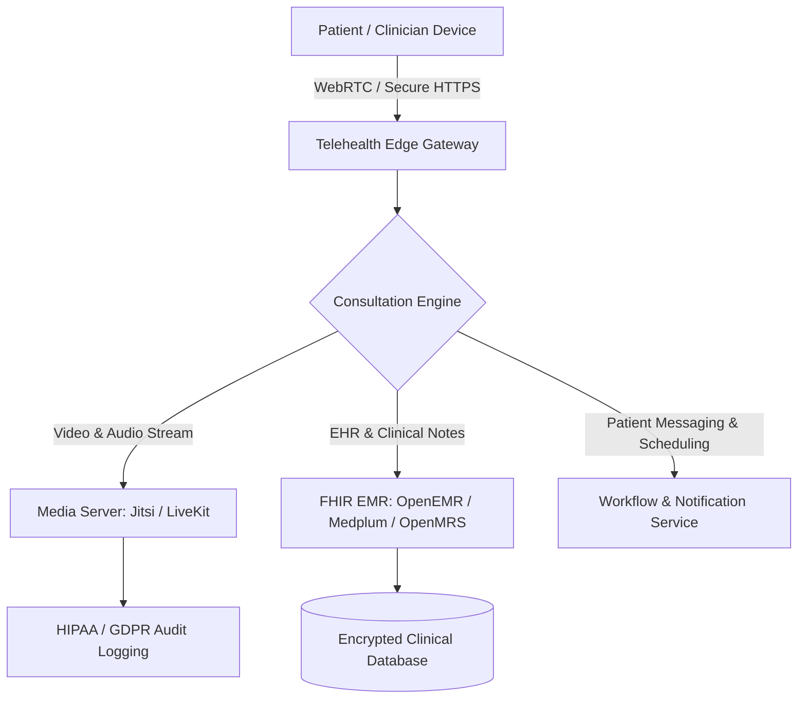

# Awesome-Telemedicine 🩺

  

  
  
  
  
  
  
  
  

---

## 🌐 Curated Telemedicine & Virtual Care Ecosystem

> 🚀 **A comprehensive, SEO-optimized directory of SaaS Telemedicine Platforms, Open-Source Telehealth Repositories, WebRTC Infrastructure, and Digital Health Solutions.**

*Focused on Virtual Visits, HIPAA/GDPR Compliance, Secure Video Consultations, Patient Portals, Electronic Health Records (EHR/EMR), e-Prescriptions, and Remote Patient Monitoring (RPM).*

**Last updated: August 2026**

---

### 🔍 Quick Overview & Highlights

This repository tracks premier **SaaS platforms** and **open-source repositories** powering modern **Telemedicine & Digital Health**. These solutions facilitate secure video/audio consultations, browser-based waiting rooms, clinical triage, asynchronous messaging, and EHR connectivity for independent practices, hospitals, non-profits, and enterprise health systems.

- 🏥 **Enterprise & Small Clinic SaaS:** Ranked and sorted by company valuation and annual revenue, with verified entry-level pricing and exact free tier/trial limits.
- 💻 **Open-Source & Self-Hosted Telehealth:** Curated by GitHub community traction (stargazers count) for full data sovereignty and custom health workflows.
- 🔒 **Compliance & Security:** Supporting HIPAA, HITRUST, GDPR, and WebRTC encryption standards.

---

## 📑 Table of Contents

- [🏢 SaaS / Hosted Telemedicine Platforms](#-saas--hosted-telemedicine-platforms)
- [💻 Open-Source GitHub Projects](#-open-source-github-projects)
- [🛠️ Architecture & Deployment Frameworks](#️-architecture--deployment-frameworks)
- [🤝 How to Contribute](#-how-to-contribute)
- [📈 Star History](#-star-history)
- [⚠️ Disclaimer](#️-disclaimer)

---

## 🏢 SaaS / Hosted Telemedicine Platforms

*Ranked and sorted by company size (**Market Capitalization / Valuation / Annual Revenue**) in descending order.*

| 🏥 Platform | 💰 Company Size (Valuation / Revenue) | 📝 Description & Key Features | 🏷️ Starting Price | ⏱️ Free Tier / Free Trial Limits |
| :--- | :--- | :--- | :--- | :--- |
| **[Zoom for Healthcare](https://www.zoom.com/en/healthcare/)** | **~$28B - $31B Market Cap** (~$4.67B Ann. Revenue) | HIPAA-compliant video visit and clinical collaboration suite with signed Business Associate Agreement (BAA), waiting rooms, and EHR integration. | **$15.99/user/mo** (or $149.90/user/yr with signed BAA) | **Free Basic plan**: Up to 100 participants with 40-min limit *(Note: Free Basic plan does not include HIPAA BAA; healthcare compliance requires paid tier)*. **30-day free trial** available for paid Workplace tiers. |
| **[Teladoc Health](https://www.teladochealth.com/)** | **~$1.2B Market Cap** (~$2.7B Ann. Revenue) | Large-scale virtual care and telehealth operating system (Solo platform) offering enterprise-level virtual visits, hospital-in-home, and remote monitoring. | **$75/visit** (Pay-per-visit direct consultation) or **~$1,000/facility/mo** base platform licensing | **30-day guided pilot/sandbox**: Provides simulated clinical workflows, virtual care routing, and EHR integration testing upon enterprise consultation. No free forever plan. |
| **[Tebra](https://www.tebra.com/)** | **~$1.0B+ Valuation** (~$200M Ann. Run Rate) | Integrated EHR, medical billing, and patient experience suite with built-in telehealth consultations for independent ambulatory practices. | **$149/provider/mo** (Clinical telehealth & scheduling bundle) | **14-day guided trial/sandbox**: Complete environment with sample EHR records, scheduling, virtual waiting room, and video visit testing after demo. No free forever plan. |
| **[Amwell](https://business.amwell.com/)** | **~$200M - $210M Market Cap** (~$250M Ann. Revenue) | Comprehensive virtual care platform and telehealth software suite for private practices, health systems, and hybrid care delivery. | **$49/user/mo** (Amwell Private Practice, 1–10 users; volume discounts down to $39/user/mo) | **30-day free trial**: Full access to HIPAA-compliant video consultations with up to 20 participants per visit; no credit card required to start trial. No free forever plan. |
| **[Doxy.me](https://doxy.me/)** | **~$200M+ Est. Valuation** (~$50M+ Ann. Revenue) | Lightweight, browser-based telemedicine platform for independent clinicians and healthcare teams; includes personalized URL and virtual waiting room. | **$0/mo** (Paid Pro plan starts at **$35/user/mo** or $29/mo billed annually) | **Free forever plan**: Unlimited 1-on-1 audio/video minutes, SD video quality, text chat, and standard virtual waiting room. Limited to single clinician & 1-on-1 calls (no group calling, screen sharing, HD video, or custom branding). |
| **[SimplePractice](https://www.simplepractice.com/)** | **~$4.0B Parent Valuation** (~$37M+ Ann. Revenue) | All-in-one practice management, EHR, and telehealth system designed for behavioral health and private wellness clinics. | **$49/mo** (Starter plan; Essential at $79/mo, Plus at $99/mo) | **30-day free trial**: Full access to paperless intake, client portal, appointment scheduling, and telehealth video sessions (no credit card required). No free forever plan. |
| **[Klara](https://www.klara.com/)** | **~$5.3B Parent Valuation** (~$15M - $18M Ann. Revenue) | Patient communication and engagement platform supporting asynchronous messaging, intake workflows, and virtual visits. | **$125/provider/mo** (Messaging and telehealth starting tier) | **14-day free trial/pilot**: Sandbox access with sample patient messaging threads, automated appointment reminders, and video consultation testing. No free forever plan. |
| **[Updox](https://www.updox.com/)** | **~$1.5B Parent Valuation** (~$14M Ann. Revenue) | Healthcare collaboration and communication hub combining video visits, secure messaging, e-fax, and patient engagement. | **$50/provider/mo** (Telehealth & communications tier) | **14-day free trial**: Access to video visit features, secure bi-directional SMS, and digital fax testing for up to 5 team members. No free forever plan. |
| **[Coviu](https://www.coviu.com/)** | **~$40M+ Est. Valuation** (~$11M Ann. Revenue) | Browser-first telehealth platform tailored for video consultations, interactive clinical assessments, and in-call diagnostic tools. | **$25/user/mo** (Billed annually) or **$35/user/mo** (Essentials monthly) | **14-day free trial**: Full access to Standard tier features including unlimited 1-on-1 and group video calls (up to 6 participants), screen sharing, and clinical assessment add-ons (no credit card required). No free forever plan. |
| **[Mend](https://www.mend.com/)** | **~$20M+ Est. Valuation** (~$5M Ann. Revenue) | Telehealth and patient engagement suite featuring digital intake forms, automated appointment reminders, and virtual waiting rooms. | **$49/provider/mo** (Core virtual visit & intake bundle) | **14-day free trial**: Access to digital intake forms, appointment scheduling, and video consultation sandbox testing for clinical staff. No free forever plan. |

---

## 💻 Open-Source GitHub Projects

*Ranked and sorted by GitHub community popularity (**Star Counts**) in descending order.*

1. **[Jitsi Meet](https://github.com/jitsi/jitsi-meet)**   
   🎥 *Secure, Simple, and Scalable WebRTC Video Conferences.* Widely customized, white-labeled, and self-hosted for clinical telehealth rooms, encrypted consultations, and patient-doctor calls.

2. **[LiveKit](https://github.com/livekit/livekit)**   
   ⚡ *End-to-end realtime WebRTC stack and audio/video infrastructure.* High-performance developer platform used to build custom telehealth applications with AI voice agents, screen sharing, and end-to-end encryption.

3. **[BigBlueButton](https://github.com/bigbluebutton/bigbluebutton)**   
   🖥️ *Open-source web conferencing system.* Features real-time sharing of slides, whiteboard, chat, voice, and video, frequently adapted for clinical training, teleconsultations, and group therapy.

4. **[HospitalRun](https://github.com/HospitalRun/hospitalrun-frontend)**   
   🏥 *Modern open-source software for healthcare in developing regions.* Designed to support remote clinics, electronic health records, patient administration, and digital consultations with offline-first capabilities.

5. **[OpenEMR](https://github.com/openemr/openemr)**   
   🩺 *ONC-certified open-source electronic health records and practice management system.* Includes native telehealth modules, patient portals, e-prescriptions, scheduling, and FHIR interoperability.

6. **[Medplum](https://github.com/medplum/medplum)**   
   🚀 *Headless EHR, API-first patient portal, and telehealth developer platform.* Built natively on HL7 FHIR standards, enabling developers to rapidly launch compliant virtual clinic applications and patient apps.

7. **[OpenMRS Core](https://github.com/openmrs/openmrs-core)**   
   🌍 *World-leading open-source enterprise electronic medical record system.* Deployed globally with modular architectures for remote community health worker workflows, teleconsultations, and clinical documentation.

8. **[Ottehr EHR](https://github.com/masslight/ottehr)**   
   📱 *Modular, production-ready, open-source EHR for telehealth and urgent care.* Features fast patient check-in, virtual waiting rooms, video visit integrations, and FHIR backend support.

9. **[Open Source Telemedicine](https://github.com/opensource-emr/Telemedicine)**   
   📞 *Dedicated open-source telehealth application connecting doctors and patients.* Provides real-time WebRTC video consultations, multi-doctor/clinic administration, digital documentation, and chat.

10. **[MediPi](https://github.com/rprobinson/MediPi)**   
    📊 *Open-source Telehealth Remote Patient Monitoring (RPM) client system.* Enables clinical monitoring of peripheral medical sensors (blood pressure, pulse oximetry, scales) over encrypted channels.

11. **[Intelehealth Mobile](https://github.com/Intelehealth/intelehealth-fhw-mobileapp)**   
    🚑 *Frontline Health Workers (FHW) mobile telehealth platform.* Empowers community health workers in low-resource environments to record patient vitals, conduct remote doctor consults, and deliver care.

12. **[SOAP Note Scribe](https://github.com/josephrmartinez/soapnotescribe)**   
    ✍️ *Clinical charting tool for physicians.* Automatically transcribes and generates structured SOAP notes from telehealth recordings or clinical audio consultations using AI transcription models.

13. **[HCW@Home (Health Care Worker @Home)](https://github.com/HCW-home/backend)**   
    🛡️ *Institution-grade open-source teleconsultation backend.* Delivers secure WebRTC audio/video consultations, invite links, waiting queues, and direct OpenEMR clinical connectivity.

14. **[Al-Shifa Clinic Telemedicine](https://github.com/Esraa-Dev/Al-Shifa-Clinic)**   
    🌐 *Full-stack telemedicine web platform built with React, Node.js, and MongoDB.* Includes video consultations, appointment scheduling, digital prescriptions, and multi-language patient portals.

15. **[OpenTera](https://github.com/introlab/opentera)**   
    🦽 *Open-source tele-rehabilitation server and microservices framework.* Supports synchronized multi-user video, robotic tele-assistance, and remote patient physical therapy sessions.

16. **[OpenMRS Telemedicine App](https://github.com/openmrs/openmrs-contrib-telemedicine-app)**   
    📲 *Lightweight mobile application designed for community telehealth access.* Connects patient cohorts directly to hospital medical records and scheduled remote consultations.

17. **[Zoom Web Telehealth Starter Kit](https://github.com/zoom/VideoSDK-Web-Telehealth)**   
    🧪 *Reference architecture and starter kit for custom web telehealth.* Implements patient/doctor rooms, virtual queues, and HIPAA-compliant WebRTC video using the Zoom Video SDK.

18. **[AIOTP (All In One Telehealth Platform)](https://github.com/ciips-code/aiotp)**   
    🤝 *Open-source telehealth suite commissioned with PAHO/WHO participation.* Combines OpenEMR clinical backend with Jitsi Meet video conferencing for public health deployments.

19. **[Telemedicine Website](https://github.com/aminezouari52/telemedicine-website)**   
    💡 *Real-time video consultation platform.* Built with Next.js, Node.js, MongoDB, and WebRTC, integrating LLM/AI assistance for triage and intake.

---

## 🛠️ Architecture & Deployment Frameworks

- **Video & Realtime Layer:** Deploy **Jitsi Meet** or **LiveKit** with WebRTC SFU for scalable low-latency video and group consultations.
- **EHR & Clinical Records:** Connect to **OpenEMR**, **Medplum**, or **OpenMRS** to store patient histories, SOAP notes, and prescriptions under strict access controls.
- **Security Best Practices:** Enforce TLS 1.3 encryption in transit, AES-256 at rest, end-to-end media encryption, multi-factor authentication (MFA), and role-based access control (RBAC).

---

## 🤝 How to Contribute

Contributions are warmly welcome! Help expand and maintain the digital health ecosystem:

1. 🍴 **Fork the repository.**
2. 🌿 **Create a new branch:** `git checkout -b feature/add-telehealth-tool`.
3. 📝 **Add your entry:** Include tool name, verified official/GitHub URL, 1–2 sentence description, category, and star/pricing details.
4. 📬 **Submit a Pull Request** with a descriptive summary of your changes.

*Please ensure all added tools are actively maintained, factual, and strictly relevant to telemedicine, telehealth, or digital health.*

⭐ **Star this repository** if you find it helpful for your research or practice!

---

## 📈 Star History

---

## ⚠️ Disclaimer

- This is a **community-curated index** for educational and research purposes — it does not constitute medical, legal, or financial advice.
- Telemedicine software processes Protected Health Information (PHI) and Personally Identifiable Information (PII). Deployments must comply with applicable regulations including **HIPAA**, **HITECH**, **GDPR**, and regional telehealth licensing requirements.
- Always execute appropriate Business Associate Agreements (BAAs) and conduct rigorous security audits before deploying software in clinical production.

---

  Built with ❤️ for clinicians, healthcare developers, and digital health innovators worldwide.

